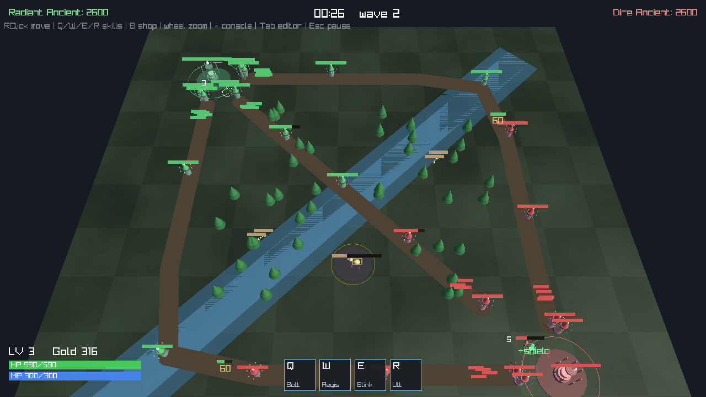

# Dota2 — своя MOBA на C++ и своём движке

Оригинальная MOBA в жанре Dota и **собственный лёгкий движок** (в духе Source),
написанные на C++. Всё содержимое оригинальное: свои модели, текстуры
генерируются кодом, свои герои, способности и предметы — ассеты Valve не
используются.



> Полноценный клон Dota 2 — это годы работы студии. Здесь свободно
> воспроизведены **механики жанра** (три линии, вышки, лес с нейтралами, босс,
> золото и предметы, способности), но на оригинальном контенте и своём движке.

## Что уже есть

**Карта как в жанре** — квадратная арена, две базы в углах, **три линии**
(верх / центр / низ) с тремя тиерами вышек, диагональная **река**, **лес** с
деревьями, **нейтральные лагеря**, **яма босса** и фонтаны.

**Бой и герой** — герой под управлением (движение правым кликом, авто-атака),
мана, **4 способности** Q/W/E/R: Arcane Bolt (снаряд-нюк), Aegis (лечение + щит),
Blink Step (рывок), Cataclysm (ульта — AoE урон + слоу + стан). Статус-эффекты:
слоу, стан, урон-по-времени. Частицы и кольца на кастах.

**Экономика** — пассивный доход золота + награда за добивания, крипов, вышки,
нейтралов и **босса** (даёт большой бонус и хилит команду). **Магазин** (`B`) с
6 предметами на статы (урон, HP, мана, скорость, броня).

**Крипы и линии** — волны крипов на всех трёх линиях, лес с нейтралами, которые
держат лагерь и респавнятся, могучий босс в яме.

**Графика** — освещение (шейдер Blinn-Phong), органичные low-poly модели из
освещённых примитивов (не кубы), процедурные текстуры земли/леса.

**Интерфейс** — главное меню с живым матчем на фоне, пауза, редактор персонажей
(`Tab`), магазин (`B`), консоль с cvars (`~`), HUD с HP/маной и панелью скиллов.

## Управление

| Действие | Клавиша / мышь |
| --- | --- |
| Двигаться | Правая кнопка мыши |
| Способности | `Q` `W` `E` `R` (по курсору) |
| Магазин | `B` |
| Редактор персонажей | `Tab` |
| Консоль | `~` |
| Зум камеры | Колесо мыши |
| Пауза | `Esc` |

## Быстрый старт

Нужны CMake ≥ 3.16, компилятор C++17. raylib подтянется автоматически (или
поставь через пакетный менеджер).

```bash
cd engine-game
cmake -S . -B build
cmake --build build -j
./build/mini_moba_engine
```

Зависимости на Linux (если raylib собирается из исходников):

```bash
sudo apt-get install -y build-essential cmake \
  libgl1-mesa-dev libx11-dev libxrandr-dev libxinerama-dev \
  libxcursor-dev libxi-dev libglu1-mesa-dev
```

Подробности архитектуры движка, консоли, редактора и графики — в
[`engine-game/README.md`](engine-game/README.md).

## Структура

```
engine-game/
  engine/   движок: Entity/World/тики, Scene (свет + примитивы), консоль/cvars, Engine
  game/     MOBA: сущности (герой/крип/вышка/трон/босс/эффекты), карта, скиллы, магазин
  data/     characters.txt — статы персонажей (правятся редактором или руками)
  third_party/ raygui (GUI), вложен
mini-moba/     ранняя 2D-версия (SFML)
mini-moba-3d/  ранняя 3D-версия (raylib)
docs/          скриншоты
```

## Идеи дальше

- Несколько героев на выбор и экран пикА.
- Настоящий редактор карт (расстановка линий/лагерей из файла).
- Звук (процедурные эффекты), день/ночь, руны на реке.
- Сетевой мультиплеер (снапшоты сущностей по тикам).
