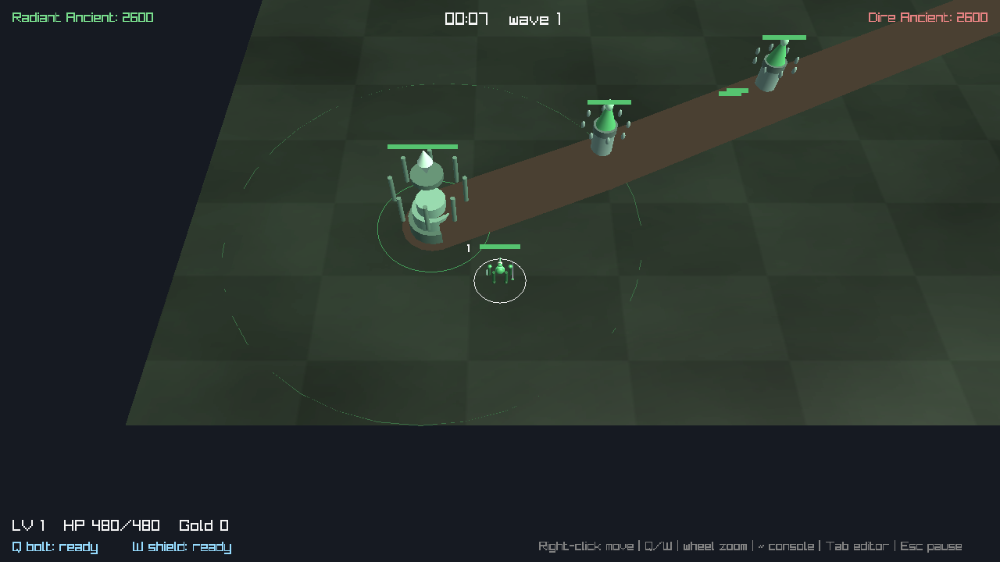
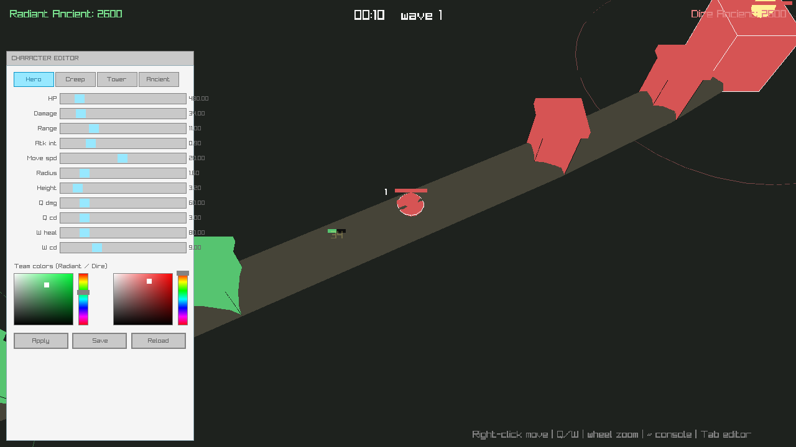

# Engine + MOBA (Source-inspired)

Свой **лёгкий игровой движок** на C++ с идеями из Source Engine, и наша MOBA,
собранная поверх него как «мод» (game module). Рендер/окно/ввод — на
[raylib](https://www.raylib.com/), всё остальное (сущности, мир, тик, консоль,
cvars) — наш код.



> Это **не** клон Source (BSP-карты, физика, сеть, Hammer — это годы работы
> студии). Это компактное ядро с теми же удобными концепциями, чтобы дальше
> было легко добавлять контент: новая фича = новый `Entity`.

## Идеи из Source, которые реализованы

| Source                     | Здесь                                                      |
| -------------------------- | --------------------------------------------------------- |
| `CBaseEntity`              | `eng::Entity` со `Spawn/Update/Think/OnTouch/Render`      |
| think-функции (`SetNextThink`) | `entity->SetNextThink(time)` → `Think()` по расписанию |
| тикрейт сервера            | фиксированный тик мира (`World::tickInterval`, 64/с)      |
| менеджер сущностей         | `eng::World` — create/remove, `FindInRadius`, тик-цикл    |
| cvars / concommands        | `eng::ConVar`, `eng::ConCommand` + консоль по `~`          |
| разделение engine/mod      | `eng::IGame` — игра подключается к движку                  |

## Архитектура

```
engine/                 переиспользуемое, не знает про MOBA
  Entity.hpp            базовая сущность (Spawn/Update/Think/OnTouch/Render/Render2D)
  World.hpp/.cpp        мир: create<T>(), Simulate() (тик), FindInRadius, удаление
  ConVar.hpp/.cpp       cvars + команды + лог консоли + Con::Exec()
  Engine.hpp/.cpp       окно, фикс-тик цикл, камера, ground-picking, рендер консоли
  IGame.hpp             интерфейс игрового модуля
game/                   собственно MOBA как набор сущностей
  Combat.hpp            CombatEntity: hp/команда/авто-атака поверх Entity
  Entities.hpp          Hero, Creep, Tower, Ancient, Projectile, Beam, FloatText
  Defs.hpp/.cpp         UnitDef + Defs: статы персонажей, load/save из файла
  Game.cpp              реализация всех сущностей + MobaGame (IGame) + редактор
  MobaGame.hpp          карта/линия, волны, победа, сервисы (враг рядом, награды)
  data/characters.txt   значения статов/цветов (правятся руками или редактором)
third_party/raygui.h    вложенная GUI-библиотека (для редактора)
src/main.cpp            создаёт Engine + MobaGame и запускает
```

Главный цикл (`Engine::Run`): ввод → `OnFrame` (камера) →
**фиксированные тики** (`OnTick` игры + `World::Simulate`: `Update` всех
сущностей, назревшие `Think`, тесты `OnTouch`, удаление помеченных) → рендер
(3D-сцена + 2D-оверлеи + консоль).

Даже эффекты — это сущности: болт (`Projectile`) летит в `Update` и наносит урон
в `OnTouch`; луч атаки (`Beam`) и всплывающие числа (`FloatText`) сами удаляются
по истечении жизни. Вся игра выражена через модель сущностей движка.

## Графика: low-poly модели кодом

Юниты — не примитивы, а **составные low-poly модели**, собранные прямо в коде из
кубов/сфер через матричный стек `rlgl` (`beginModel`/`endModel` в `Game.cpp`):
герой — корпус, голова, плечи, меч и щит (светится при `W`); башня — основание,
зубцы и кристалл; трон — ступенчатая пирамида с вращающимся кристаллом-ромбом;
крип — тельце, голова и глазки. Юниты поворачиваются по направлению движения
(поле `yaw`). Земля — процедурная текстура (клетка + перлин-шум) на плоскости.
Никаких внешних арт-файлов: всё генерится кодом, легко менять.

## Консоль и cvars (клавиша `~`)

Открой консоль тильдой и печатай:

```
help                     список всех cvar и команд
sv_wave_interval 6       волны крипов каждые 6 секунд
sv_damage_scale 5        читерский множитель урона
sv_creeps_per_wave 8     больше крипов в волне
cl_cam_dist 40           приблизить камеру
restart                  начать матч заново
win dire                 форсировать победу Dire
```

Добавить свою cvar — одна строка:
`static eng::ConVar sv_my_thing("sv_my_thing", 1.f, "описание");`

## Редактор персонажей (клавиша `Tab`)



Статы и внешний вид юнитов вынесены в данные — файл
[`data/characters.txt`](data/characters.txt), который движок читает при старте.
Их можно править руками или **вживую в игре**: нажми `Tab` — откроется панель на
[raygui](https://github.com/raysan5/raygui) (вложена в `third_party/`, качать
ничего не надо).

В панели:
- переключатель типа юнита — **Hero / Creep / Tower / Ancient**;
- слайдеры: HP, урон, радиус атаки, интервал атаки, скорость, размер, высота, а
  для героя ещё урон/кулдаун Q и лечение/кулдаун W;
- два колор-пикера — цвета команд **Radiant / Dire**;
- **Apply** — применить к уже живым юнитам; **Save** — записать в
  `characters.txt`; **Reload** — перечитать файл.

Новые юниты (волны крипов, респавн героя) сразу берут свежие значения, а цвета
команд меняются мгновенно. Так можно балансить игру без перекомпиляции.

Добавить новое поле персонажа: добавь его в `UnitDef` (Defs.hpp), пропиши
чтение/запись в `Defs.cpp`, слайдер в `drawEditor()` — и всё.

## Управление

| Действие              | Клавиша / мышь          |
| --------------------- | ----------------------- |
| Двигаться             | Правая кнопка мыши      |
| Q (болт) / W (щит)    | `Q` / `W`               |
| Зум камеры            | Колесо мыши             |
| Консоль               | `~`                     |
| **Редактор персонажей** | **`Tab`**             |
| Рестарт после игры    | `R`                     |
| Выход                 | `Esc`                   |

## Сборка и запуск

Нужны CMake ≥ 3.16 и компилятор C++17. raylib подтянется автоматически через
`FetchContent`, если не установлен в системе.

```bash
cd engine-game
cmake -S . -B build
cmake --build build -j
./build/mini_moba_engine
```

Зависимости raylib на Linux (если он собирается из исходников):

```bash
sudo apt-get install -y build-essential cmake \
  libgl1-mesa-dev libx11-dev libxrandr-dev libxinerama-dev \
  libxcursor-dev libxi-dev libglu1-mesa-dev
```

## Как добавить новую сущность (пример)

```cpp
// объявляем
class HealShrine : public game::CombatEntity {
public:
    void Spawn() override { classname = "shrine"; SetNextThink(world->time + 1.0); }
    void Think() override {            // тикаем раз в секунду
        for (auto* e : world->FindInRadius(pos, 15.f))
            if (auto* c = dynamic_cast<CombatEntity*>(e))
                if (c->team == team) c->hp = std::min(c->maxHp, c->hp + 5.f);
        SetNextThink(world->time + 1.0);
    }
    void Render() override { DrawSphere(pos, 1.5f, GOLD); }
};
// спавним где угодно: world.Create<HealShrine>()->pos = {...};
```

## Идеи дальше

- Лес с нейтралами, руны, магазин предметов за золото.
- Загрузка карты/сущностей из текстового файла (как `.vmf`/entity lump).
- Простая физика/навигация, разделение на «сервер»-тик и интерполяцию рендера.
- Сетевой мультиплеер (снапшоты сущностей по тикам).
