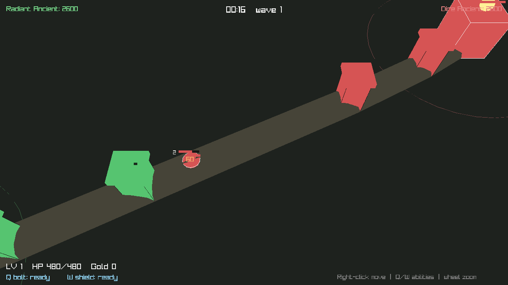

# Mini MOBA 3D

Небольшая **3D MOBA** («своя дота») на C++ и [raylib](https://www.raylib.com/).
Один герой под управлением игрока, вражеский герой-бот, волны крипов на линии,
башни и база-«трон» (Ancient) у каждой стороны. Цель — снести вражеский трон.



## Что реализовано

- **Герой + управление** — правый клик двигает героя (луч из мыши в плоскость земли),
  авто-атака ближайшего врага в радиусе.
- **Способности** — `Q` пускает болт по курсору (урон по области), `W` лечит и
  даёт щит (−50% урона на 3 c). У обоих кулдауны.
- **Крипы и линии** — каждые 22 c с обеих баз выходит волна крипов, идёт по линии,
  дерётся с врагами и башнями. За добивания даётся золото и опыт.
- **Прокачка** — герой получает опыт, растёт в уровне (больше HP и урона).
- **Башни и победа** — по 2 башни на сторону + трон. Уничтожил вражеский трон —
  **RADIANT VICTORY** / **DIRE VICTORY**, `R` — рестарт.
- **Камера** — вид сверху-под-углом, следит за героем, колесо мыши — зум.

## Управление

| Действие            | Клавиша / мышь            |
| ------------------- | ------------------------- |
| Двигаться           | Правая кнопка мыши        |
| Способность Q (болт)| `Q` (по курсору)          |
| Способность W (щит) | `W`                       |
| Зум камеры          | Колесо мыши               |
| Рестарт (после игры)| `R`                       |
| Выход               | `Esc`                     |

## Сборка и запуск

Нужны **CMake ≥ 3.16** и компилятор C++17. raylib подтянется автоматически:
если он не установлен в системе, CMake сам скачает и соберёт raylib 5.5 через
`FetchContent` (нужен интернет при первой конфигурации).

```bash
cd mini-moba-3d
cmake -S . -B build
cmake --build build -j
./build/mini_moba_3d
```

### Зависимости raylib (Linux)

Если raylib собирается из исходников, поставьте dev-пакеты OpenGL/X11:

```bash
sudo apt-get install -y build-essential cmake \
  libgl1-mesa-dev libx11-dev libxrandr-dev libxinerama-dev \
  libxcursor-dev libxi-dev libglu1-mesa-dev
```

На Windows (MSVC) и macOS `FetchContent` соберёт raylib без дополнительных
действий; на macOS линкуются системные фреймворки автоматически.

## Как это устроено

Весь код — в одном файле [`src/main.cpp`](src/main.cpp), разбитом на секции:

- `Unit` — единый тип для героя/крипа/башни/трона (поле `kind`), всё лежит в
  плоских `std::vector`, крип-слоты переиспользуются после смерти.
- Симуляция: волны → ИИ (атака ближайшего врага, движение по типу юнита) →
  снаряды → эффекты → проверка победы.
- Рендер: 3D-сцена (земля, линия-цилиндры, юниты-примитивы, лучи атак, снаряды),
  затем 2D-оверлей (полоски HP через `GetWorldToScreen`, HUD, экран победы).

Мир живёт в координатах X/Z (земля), Y — вверх. Логика идентична 2D-версии в
[`../mini-moba`](../mini-moba) — здесь поменялся только слой отображения.

## Идеи для развития

- Второй герой-союзник или больше линий и лес с нейтралами.
- Предметы и магазин за золото; настоящие модели вместо примитивов.
- Сетевой мультиплеер (raylib + enet).
