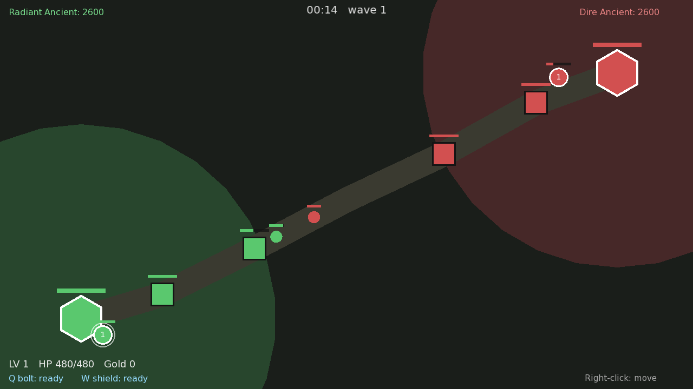

# Mini MOBA (2D)

Небольшая 2D MOBA («своя дота») на C++ и [SFML](https://www.sfml-dev.org/) —
первая версия проекта. Есть 3D-вариант в [`../mini-moba-3d`](../mini-moba-3d) и
движок в [`../engine`](../engine).



## Что реализовано

- **Герой + управление** — правый клик двигает героя, авто-атака ближайшего врага.
- **Способности** — `Q` болт по курсору (урон по области), `W` лечение + щит.
- **Крипы и линии** — волны крипов идут по диагональной линии, дерутся, дают золото/опыт.
- **Башни и победа** — по 2 башни + трон (Ancient) на сторону; снёс вражеский трон — победа.
- Прокачка уровня героя, вражеский герой-бот.

## Управление

| Действие             | Клавиша / мышь        |
| -------------------- | --------------------- |
| Двигаться            | Правая кнопка мыши    |
| Q (болт) / W (щит)   | `Q` / `W`             |
| Рестарт после игры   | `R`                   |
| Выход                | `Esc`                 |

## Сборка и запуск

Нужны CMake ≥ 3.16, компилятор C++17 и SFML 2.5+.

```bash
sudo apt-get install -y libsfml-dev cmake build-essential   # Debian/Ubuntu
cd mini-moba
cmake -S . -B build
cmake --build build -j
./build/mini_moba
```

Шрифт для текста лежит в `assets/font.ttf` (DejaVu Sans) и копируется рядом с
бинарником; если его нет, используется системный шрифт.

## Структура

```
src/
  Math.hpp        векторные хелперы поверх sf::Vector2f
  Entities.hpp    типы: Unit (kind), Projectile, Beam, FloatText
  Game.hpp/.cpp   состояние мира, симуляция, боевка, волны, победа
  Render.cpp      весь рендер (карта, юниты, HUD, экран победы)
  main.cpp        точка входа
```
